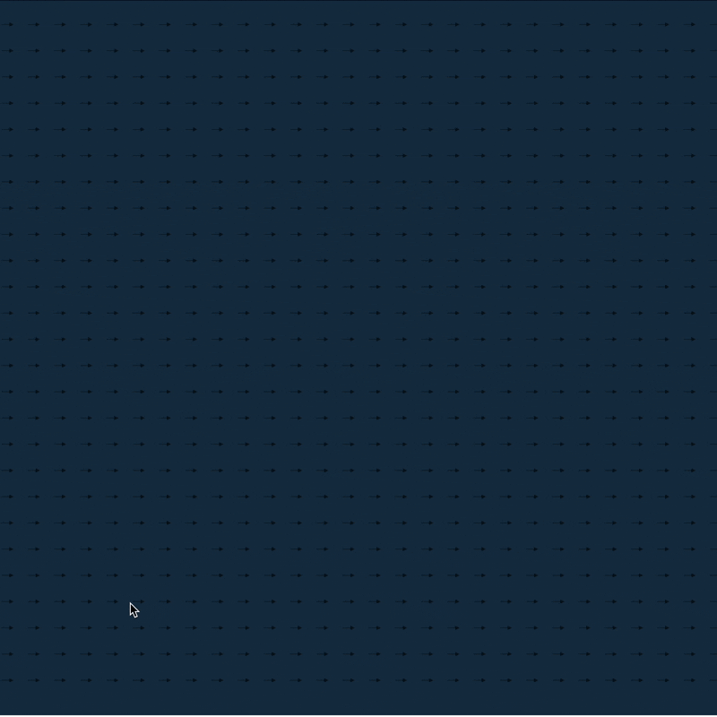

visit https://github.com/Emruur/CreativeBrushes

# How To Use?
cd /path/to/this/directory

python -m http.server 8000

# Creative Brushes

Creative brushes will allow you to direct autonomous drawing agents to draw creative sketches.  
The drawing agents act as interesting and non-predictable brushes that will steer you in the right creative direction.  
This system draws inspiration from natural dynamic drawing mediums that add their own touch to the artwork, such as watercolors and Turkish marbling art (Ebru).

    
    
    

## Autonomus Agents

**Autonomous Agents**

Autonomous agents are computational entities designed to operate
independently, perceiving and responding to their environment based on
simple yet effective behavioral rules. In this project, these agents are
conceptualized as \"vehicles\" that dynamically interact with their
surroundings to produce emergent visual patterns.

**Key Characteristics**

-   **Autonomy**: Each agent acts independently, using local information
    and internal rules to decide its actions without external control.

-   **Perception**: Agents detect elements in their environment, such as
    paths or flow fields, which influence their decisions and movement.

-   **Action**: Based on their perception, agents adjust their position
    and orientation, leaving visually compelling trails that contribute
    to the overall system dynamics.

**Seeking Behavior**

The primary behavior driving these agents is their ability to \"seek\" a
target. Seeking is a steering behavior where an agent calculates the
direction and velocity required to move toward a specific goal. This
involves:

1.  Determining the **desired direction** to the target.

2.  Adjusting movement to align with the target while maintaining smooth
    transitions.

3.  Balancing speed and force to avoid overshooting or unnatural
    movements.

This behavior allows the agents to follow paths, approach specific
points, or navigate flow fields effectively. The outcome is a visually
dynamic and natural-looking movement, with agents appearing to
\"intentionally\" pursue goals.

**Parameters Governing Seeking**

The seeking behavior is modulated by two core parameters:

-   **Maximum Speed**: Defines the upper limit of an agent\'s velocity.
    A higher value results in faster movement, but excessive speed may
    reduce smoothness and precision.

-   **Maximum Force**: Restricts the steering adjustments the agent can
    make. Lower values produce gradual, fluid turns, while higher values
    allow for sharp and reactive movements.

These parameters ensure that each agent balances responsiveness and
stability, enabling a wide range of motion profiles to suit different
scenarios.

**Role in the System**

Seeking behavior is integral to the system, driving the agents' ability
to:

-   Navigate flow fields: Agents align with the flow\'s direction while
    moving toward designated paths.

-   Approach targets: Whether a static point or a moving goal, agents
    continuously adjust to converge on their objective.

-   Contribute to visual dynamics: The trails left by agents reflect
    their smooth, coordinated movements, creating an aesthetically
    engaging output.

**Emergent Patterns**

Although each agent operates independently with simple rules, their
interactions with the environment and other agents result in complex,
emergent behaviors. This highlights the strength of autonomous systems
in producing intricate outputs from minimal individual logic.

## Flow Field Following
### Flow Fields

Flow fields are that store directions. In our 2d case it is a 2d matrix that stores 2d vectors.

We can make our agents follow this flow fields rather than seeking a target as explained previously. To do that we query the flow field to obtain the corresponding vector to be followed depending on the agents curent position. Than we set the agents desired vector with the vector that is returned by the flow field.

A parameter of a flow field is its resolution. We can have a flow field that has a vector for each pixel in the canvas but its often computationally unfeasible, thus lower resolution flow fiewlds are often used in practice where the canvas is divided into a grid of pixels and each cell of pixels have a common direction vector.

The resolution of the flow field is a major parameter to alter the drawing behaviour, thus we will have a *flowFieldResolution* drawing parameter.

https://natureofcode.com/autonomous-agents/#flow-fields

## Modifying the flow field

To direct the agents path we can alter the flow field. To do that we define a radius and attract the the vectors within that radius to the mouse location. With this method we can essentially draw on a path on the flow field and the agents that come accross our path will follow it.  However a problem with this method is that at the end of the path a black hole forms where every vector within that radius points to the center and any agent that come accross the black hole gets stuck. To solve this issue we take the mouse location of the previous timestep and extrapolate the position of the next mouse location such that it falls on the rim of the attraction circle.

**Equation for the Attract Point**

futureTarget = target_pos + velocity

Where:

- velocity = target_pos - previousTarget
- ||velocity|| = radius_pixel (scaled to match the radius)

    
    

Note that the agents start drawing once they enter the attraction radius of the path and they gradually increase their stroke once they enter the radius and decrease their stroke once they leave the attraction radius for a smooth effect.  

This process in total gives us three drawing parameters that can be modified to alter the drawing behaviour.

- AttractionRadius
- StrokeUp
- StrokeDown

### Multiple Flow Fields

When the drawn path directs towards the flow field we get sub-optimal drawing performance from agents. To owecome this issue we 4 flow fields in 4 directions(left to right, top to bottom and etc) and let 4 sets of agent groups track these fields. As a result more coherent drawings for different angled paths are obtained.

## How to find good parameters that draw good

So far a dozen parameters that alter the end drawing drastically have mentioned. These parameters have weird interactions with each other and often yield unexpected results. To find a good configuration we set reasonable ranges for each parameter and used two methods to find the configurations we liked, manual configuration and evolutionary search.

### Define reasonable ranges for each parameter

| Parameter                | Min  | Max  | Step  |
|--------------------------|------|------|-------|
| numOfVehicles            | 1    | 300  | 1     |
| trackingIterations       | 100  | 1500 | 50    |
| flowFieldResolution      | 4    | 200  | 1     |
| attractionRadius         | 5    | 100  | 5     |
| maxVehicleForce          | 0.2  | 5    | 0.1   |
| maxVehicleSpeed          | 1    | 10   | 0.5   |
| maxVehicleStroke         | 1    | 10   | 0.5   |
| maxVehicleTrailLength    | 10   | 200  | 10    |
| vehicleStrokeUp          | 0.1  | 1    | 0.1   |
| vehicleStrokeDecay       | 0.1  | 1    | 0.1   |
| filteredOrientations     | 1    | 4    | 1     |

### Evolutionary Search
The **evolutionary search** in this project is inspired by natural selection. It helps optimize the parameters of autonomous drawing agents to create more creative and visually appealing drawings. The process involves steps like mutation, crossover, and selection to improve the parameters over time.

#### How It Works

The evolutionary search process follows these steps:

1. **Initialization**:  
   - The process begins by generating random parameter sets. Each set defines characteristics like the number of agents, how long they track paths, and the resolution of the flow field.

2. **Evaluation**:  
   - Each parameter set is tested to see how well it performs. This could mean how visually appealing the drawing is or how well the agents follow the desired paths.

3. **Selection**:  
   - The best-performing parameter sets are chosen to move forward. These are the ones that produce the most effective or creative drawings.

4. **Crossover**:  
   - Two selected parameter sets are combined to create a new one. This mixes traits from both sets, creating new possibilities.

5. **Mutation**:  
   - Small random changes are applied to some parameters. This keeps the process flexible and helps the system try out new ideas.

6. **Iteration**:  
   - These steps are repeated over multiple rounds, or generations, until the system finds a parameter set that works well or reaches a stopping point.

#### Why It’s Useful

The evolutionary search is important because it:

- Automatically adjusts parameters to create better and more unique drawings.  
- Explores a wide range of parameter combinations without requiring manual tuning.  
- Helps the agents interact effectively with flow fields, resulting in smoother and more creative outputs.  

By using evolutionary search, the project achieves diverse and creative results while reducing the need for human intervention in fine-tuning parameters.

### Modifying the parameters manually

The behavior of the DrawingAgent system, implemented through the
DrawingAgent.js and AgentGroup classes, can be fine-tuned by adjusting
key parameters. These modifications can be performed directly within the
associated **tune.js** and **tune.html** files, enabling both static and
dynamic configuration of the system.

**Configuration via tune.js**

The **tune.js** file contains a selfParams object where all key
parameters are defined. These include:

-   **numOfVehicles**: Number of vehicles in each group *(1--300)*.

-   **trackingIterations**: Number of tracking calculations
    *(100--1500)*.

-   **flowFieldResolution**: Grid resolution for flow fields *(4--200)*.

-   **attractionRadius**: Radius of attraction to targets *(5--100)*.

-   **maxVehicleForce**: Maximum steering force *(0.2--5)*.

-   **maxVehicleSpeed**: Maximum speed *(1--10)*.

-   **maxVehicleStroke**: Vehicle stroke width *(1--10)*.

-   **maxVehicleTrailLength**: Length of trails *(10--200)*.

-   **vehicleStrokeUp**: Stroke increment *(0.1--1)*.

-   **vehicleStrokeDecay**: Stroke decay rate *(0.1--1)*.

-   **filteredOrientations**: Number of orientations for smoothing
    *(1--4)*.

Example configuration in tune.js:

const selfParams = {

numOfVehicles: 50,

trackingIterations: 1000,

flowFieldResolution: 10,

attractionRadius: 20,

maxVehicleForce: 1.0,

maxVehicleSpeed: 5.0,

maxVehicleStroke: 3.0,

maxVehicleTrailLength: 100,

vehicleStrokeUp: 0.5,

vehicleStrokeDecay: 0.2,

filteredOrientations: 2

};

**Real-Time Adjustments via tune.html**

The **tune.html** file facilitates user-friendly, real-time
modifications through interactive elements such as sliders and input
fields. These inputs dynamically update the values of parameters in
tune.js during runtime.

For instance:

\<label for=\"numVehicles\"\>Number of Vehicles:\</label\>

\<input type=\"range\" id=\"numVehicles\" min=\"1\" max=\"50\"
value=\"20\"\>

Using JavaScript event listeners, parameter changes can be propagated to
the system:

document.getElementById(\'numVehicles\').addEventListener(\'input\', (e)
=\> {

selfParams.numOfVehicles = e.target.value;

drawingAgent.setVehicles(); // Reinitialize vehicles

});

**Experimental Adjustments**

Below are examples of configurations and their expected outcomes:

-   **High-Density Movement**:

> const selfParams = { numOfVehicles: 50, maxSpeed: 3, maxForce: 0.05 };

-   **Minimalist and Fast Movement**:

> const selfParams = { numOfVehicles: 10, maxSpeed: 10, maxForce: 0.2 };

## Results

Here are some of the artwork we created with the system. When started with a creative brush the system can alter the perceptive state of the user such that it allows them to be creative. Its almost like looking at clouds and seeing some objects. It allows rapid construction of interesting drawings since the system itself adds a lot of texture and detail and the user can have a high level thinking/execution. User can add its own brushes to the system for which they can be more creative and comfortable with which improves on the usability of the system. Further systems can experiment with path following agents rather than flow field following agents.

    
    
    

Images Space Bug, The Fish and the Monster tamer respectively

